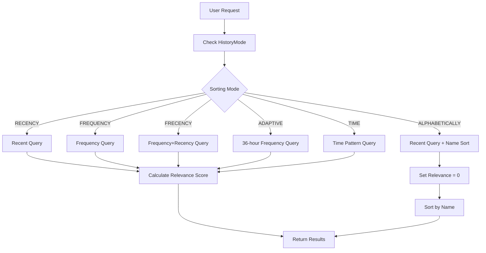

# KISS Launcher History Sorting System Guide

## Overview

KISS Launcher provides 6 different sorting algorithms for analyzing user app usage history.  
Each sorting mode has unique characteristics and use cases, offering optimized app accessibility tailored to users' patterns.

## Supported History Modes

### 1. RECENCY (Recently Used) - Default ⭐

**Description**: Displays the most recently used apps first

**Features**:

- Most intuitive and predictable sorting
- Fast performance (simple ID-based sorting)
- Reflects immediate usage patterns

**Use Cases**:

- General users
- Simple app usage patterns
- When fast response is critical

**Implementation**:

```sql
SELECT record FROM history ORDER BY _id DESC LIMIT n
```

### 2. FREQUENCY (Usage Frequency) 📊

**Description**: Displays apps with the highest total usage count first

**Features**:

- Reflects long-term usage patterns
- Slowest to change ranking
- Prioritizes frequently used core apps

**Use Cases**:

- Users with consistent app usage patterns
- Users with a fixed set of core apps
- When long-term usage statistics are important

**Implementation**:

```sql
SELECT record, count(*) FROM history 
GROUP BY record 
ORDER BY count(*) DESC 
LIMIT n
```

### 3. FRECENCY (Frequency + Recency) 🚀

**Description**: Advanced algorithm combining usage frequency and recency

**Features**:

- Algorithm inspired by Firefox browser
- Balanced combination of frequency and recency
- Performance optimization based on memory/disk mode

**Formula**:

```text
frecency_score = frequency × (1.0 + time_weight)
time_weight = (current_time - min_timestamp) / 86400000.0  // weight calculation based on days
```

**Use Cases**:

- Power users wanting balanced recommendations
- Users who use various apps periodically
- When both optimized performance and accuracy are needed

### 4. ADAPTIVE (36-hour Based) 🔄

**Description**: Considers only usage frequency from the last 36 hours

**Features**:

- Context-based recommendations
- Fast change reflection
- Learns temporary usage patterns

**Use Cases**:

- Users with distinct weekend/weekday apps
- Developers using different apps per project
- Users with frequent temporary app usage

**Implementation**:

```sql
SELECT record, count(*) FROM history 
WHERE timeStamp > (current_time - 36 * 3600000) 
GROUP BY record 
ORDER BY count(*) DESC 
LIMIT n
```

### 5. TIME (Time-based Pattern) ⏰

**Description**: Prioritizes apps used at similar times to the current time

**Features**:

- 24-hour cycle triangle wave algorithm
- Learns daily routine patterns
- Complex time weighting calculation

**Use Cases**:

- Users with consistent time-based routines
- Users with clearly separated work/personal time
- Patterns of using specific apps at specific times

**Algorithm**:

```sql
-- Time weighting using 24-hour cycle triangle wave
MAX(ABS((now - timestamp) % 86400000 - 43200000) - (now - timestamp) / 48)
```

### 6. ALPHABETICALLY (Alphabetical Order) 🔤

**Description**: Sorts by app name alphabetically

**Features**:

- Predictable fixed order
- Search efficiency
- Consistency independent of usage patterns

**Use Cases**:

- Users preferring predictable order
- Users wanting systematic app management
- Preference for name-based search

## Implementation Architecture

### Core Components

#### 1. HistoryMode Enum

```java
public enum HistoryMode {
    RECENCY("recency"),
    FRECENCY("frecency"),
    FREQUENCY("frequency"),
    ADAPTIVE("adaptive"),
    TIME("time"),
    ALPHABETICALLY("alphabetically");
}
```

#### 2. DBHelper Class

- Database query implementation for each sorting mode
- Performance optimization logic
- Memory/disk mode management

#### 3. DataHandler Class

- History mode settings management
- Relevance score calculation
- Sorting result post-processing

### Sorting Process Flow



## Performance Optimization

### 1. Memory Mode

```java
// Use memory DB for frequent history queries
private static Cursor getMemoryHistoryByFrecency(Context context, int limit) {
    // Keep only 3 days of data in memory
    // Minimize disk I/O
}
```

### 2. Query Optimization

- **Time-based filtering**: Exclude unnecessary old data
- **Subquery optimization**: Reduce complexity for better performance
- **Index utilization**: Optimal use of `_id` and `timeStamp` indexes

### 3. Automatic Cleanup System

```java
private static void cleanupHistoryAsync(Context context, SQLiteDatabase db) {
    // Automatically delete records older than 90 days
    // Execute VACUUM when more than 100 records are deleted
}
```

## Settings Management

### SharedPreferences Integration

```java
public HistoryMode getHistoryMode() {
    SharedPreferences prefs = PreferenceManager.getDefaultSharedPreferences(context);
    return HistoryMode.valueById(prefs.getString("history-mode", "recency"));
}
```

### XML Settings Definition

```xml
<!-- Options displayed to users -->
<string-array name="historyModeEntries">
    <item>@string/history_recency</item>
    <item>@string/history_frecency</item>
    <item>@string/history_frequency</item>
    <item>@string/history_adaptive</item>
    <item>@string/history_time</item>
    <item>@string/history_alphabetically</item>
</string-array>

<!-- Actual stored values -->
<string-array name="historyModeValues">
    <item>recency</item>
    <item>frecency</item>
    <item>frequency</item>
    <item>adaptive</item>
    <item>time</item>
    <item>alphabetically</item>
</string-array>
```

## Performance Comparison

| Sorting Mode | Computational Complexity | Memory Usage | Change Speed | Accuracy |
|--------------|--------------------------|--------------|-------------|----------|
| RECENCY | O(1) | Low | Immediate | High |
| FREQUENCY | O(n log n) | Medium | Slow | Medium |
| FRECENCY | O(n log n) | High | Medium | High |
| ADAPTIVE | O(n log n) | Medium | Fast | High |
| TIME | O(n log n) | Medium | Medium | Medium |
| ALPHABETICALLY | O(n log n) | Low | None | N/A |

## Usage Recommendations

### Recommendations by User Type

#### 🟢 General Users

- **RECENCY**: Most intuitive and fast experience
- Ready to use immediately without settings changes

#### 🔵 Power Users

- **FRECENCY**: Balanced optimal experience
- Best combination of performance and accuracy

#### 🟡 Context-based Users

- **ADAPTIVE**: When situational app usage patterns are distinct
- Users with clear weekend/weekday, work/personal distinctions

#### 🟣 Routine-based Users

- **TIME**: Users with consistent time-based patterns
- Habits of using specific apps at specific times

#### ⚫ Systematic Management Preference Users

- **ALPHABETICALLY**: Preference for predictable order
- Want to organize many apps logically

## Developer Guide

### Adding New Sorting Modes

1. **Add new value to HistoryMode enum**

```java
public enum HistoryMode {
    // Existing modes...
    NEW_MODE("new_mode");
}
```

1. **Implement query method in DBHelper**

```java
private static Cursor getHistoryByNewMode(SQLiteDatabase db, int limit) {
    // Implement new sorting logic
}
```

1. **Add case to switch statement**

```java
switch (historyMode) {
    // Existing cases...
    case NEW_MODE:
        cursor = getHistoryByNewMode(db, limit);
        break;
}
```

1. **Update XML resources**

```xml
<string-array name="historyModeValues">
    <!-- Existing values... -->
    <item>new_mode</item>
</string-array>
```

### Testing Considerations

1. **Performance Testing**: Response time with large history datasets
1. **Memory Testing**: Check for memory leaks during extended use
1. **Accuracy Testing**: Verify alignment with actual usage patterns
1. **Stability Testing**: Recovery in database corruption scenarios

## Future Improvements

### 1. Machine Learning-based Sorting

- Learn user behavior patterns
- Automatic adjustment of personalized weights
- Enhanced context awareness

### 2. Performance Optimization

- More efficient caching strategies
- Background pre-computing
- Memory usage optimization

### 3. User Experience Improvements

- Real-time sorting mode switching
- Sorting effect visualization
- Personalization settings wizard

## Troubleshooting

### Common Issues and Solutions

#### 1. History Not Loading

```java
// Check database connection
SQLiteDatabase db = getDatabase(context);
if (db == null || !db.isOpen()) {
    // Reinitialize database
}
```

#### 2. Poor Performance

- Check if memory mode is activated
- Run history cleanup
- Clean old data

#### 3. Unexpected Sorting Results

- Check history mode settings
- Clear cache
- Restart app

## References

- [Firefox Frecency Algorithm](https://wiki.mozilla.org/Places/Frecency_algorithm)
- [SQLite Performance Optimization](https://www.sqlite.org/optoverview.html)
- [Android SharedPreferences Best Practices](https://developer.android.com/training/data-storage/shared-preferences)

---

*This document is written based on KISS Launcher v3.x. There may be differences with the latest version.*

## Changelog

| Version | Date | Changes |
|---------|------|---------|
| 1.0 | 2025-08-19 | Initial document creation |
